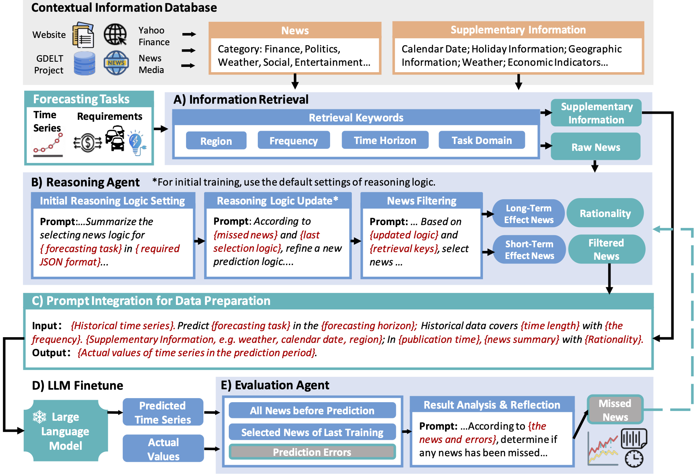

# From News to Forecast: Iterative Event Reasoning in LLM-Based Time Series Forecasting (NeurIPS 2024)

> [[Paper (arXiv)](https://arxiv.org/pdf/2409.17515v1)] <br>
> [Xinlei Wang](https://scholar.google.com/citations?user=BfaMv18AAAAJ&hl=en), Maike Feng, [Jing Qiu](https://scholar.google.com/citations?user=QUclXRoAAAAJ&hl=en), [Jinjin Gu](https://www.jasongt.com/), [Junhua Zhao](https://www.zhaojunhua.org/) <br>
> School of Electrical and Computer Engineering, The University of Sydney; <br>
> School of Science and Engineering, The Chinese University of Hong Kong, Shenzhen; <br>
> Shenzhen Institute of Artificial Intelligence and Robotics for Society <be>


This repository contains the code and dataset for our paper: **"From News to Forecast: Iterative Event Reasoning in LLM-Based Time Series Forecasting"**, presented at NeurIPS 2024.

## Abstract

This paper introduces a novel approach to enhance time series forecasting using Large Language Models (LLMs) and Generative Agents. Our method integrates real-world social events, extracted from news, with traditional time series data. This allows our model to respond to unexpected incidents and societal shifts, improving the accuracy of predictions.

The main components of our system are:
- **LLM-based agents**: Automatically filter and analyze relevant news for time series forecasting.
- **Data preparation and fine-tuning**: After pairing the selected news with the time series data, the model is fine-tuned to enhance forecasting accuracy further.
- **Reasoning logic updates**: Refine the selection of news and improve prediction accuracy iteratively.



## Features

- Integration of unstructured news data into numerical time series forecasting.
- Iterative event reasoning through LLMs to continuously refine predictions.
- Application across multiple domains, including energy, exchange, bitcoin, and traffic forecasting.

## Dataset
### Overview

Our dataset is an important part of research covering multiple areas where time series forecasting can be enhanced by integrating real-world events and news data. The dataset includes structured numerical data and unstructured textual information, providing a unique combination of insights to achieve more accurate and adaptive forecasts. The model combines structured time series data with unstructured news data to improve forecast accuracy in various areas, including electricity demand, Bitcoin price, exchange rate, and traffic. 

We provide:

- State-level half-hourly electricity load data with supplementary information provided by the Australian Energy Market Operator (AEMO) in the code, covering the period from 2019 to 2023 (`Agent/Data_all/AU_load/AULF-2019-2023.csv`);
- Time series data for daily exchange rate data with a special focus on the Australian dollar between 2018 and 2022;
- Time series data for daily Bitcoin price from 2019 to 2021;
- Time series data for hourly traffic volume data in various California roads between 2015 and 2016.

### News Data

The News data is collected from a variety of sources, including:
- **GDELT Project**: A global database that monitors news media worldwide in real-time.
- **Yahoo Finance**: For financial news related to the exchange rate and Bitcoin price domains.
- **News AU**: News for Australian national or international Events.

The Australian news data used in the forecasting model for the energy and exchange domains is stored in the `raw_data/AU-news` directory, and the raw news data related to the Bitcoin and traffic domains is stored in the `raw_news_data` directory. Use `cat data/raw_news_data/AU-news/news_processed_data_2019_part_* > data/raw_news_data/AU-news/news_processed_data_2019_merged.json` to merge the file parts.

We also enhance the dataset with supplementary information such as weather data (from OpenWeatherMap), calendar dates, and economic indicators to further enrich the context for forecasting.

## Program Details

### Finetune LLM for Times Series Forecasting

1. Install anaconda sandbox environment:
   ```bash
   conda create -n llm_news_ts python=3.9 -y
   conda activate llm_news_ts
   ```

2. Clone the repository and navigate to the project directory:
    ```bash
    git clone https://github.com/ameliawong1996/From_News_to_Forecast.git
    cd From_News_to_Forecast
    ```

3. Install the necessary dependencies (make sure `requirements.txt` is provided with the needed packages):
    ```bash
    pip install -r requirements.txt
    ```

4. Varify bitsandbytes.
   ```bash
   python -m bitsandbytes
   ```

5. Download Pre-trained Language Model.
    ```bash
    python model_download.py --repo_id daryl149/llama-2-7b-chat-hf
    ```

6. Finetune LLM to predict time series. Replace the path `{}` in to your path. Fine-tuning the 7B language model requires 16GB of video memory or more (P100 or T4 or above) and one or more graphics cards. Our work uses a single A100 (40GB) for training. The training time is about one day.
   ```bash
   deepspeed --include localhost:0 --master_port 29000 llm-finetune.py \
    --model_name_or_path {path_to_your_downloaded_model:daryl149/llama-2-7b-chat-hf} \
    --tokenizer_name {path_to_your_downloaded_model:daryl149/llama-2-7b-chat-hf} \
    --train_files {path_to_your_time_series_data;example:ts_data/AU_load_with_News_train.json} \
    --validation_files  {path_to_your_time_series_data;example:ts_data/AU_load_with_News_test.json} \
    --per_device_train_batch_size 4 \
    --per_device_eval_batch_size 4 \
    --do_train \
    --do_eval \
    --use_fast_tokenizer true \
    --output_dir {path_where_you_save_your_results} \
    --evaluation_strategy  steps \
    --max_eval_samples 400 \
    --learning_rate 1e-4 \
    --gradient_accumulation_steps 4 \
    --num_train_epochs 8 \
    --warmup_steps 400 \
    --load_in_bits 8 \
    --lora_r 8 \
    --lora_alpha 16 \
    --target_modules q_proj,k_proj,v_proj,o_proj,down_proj,gate_proj,up_proj \
    --logging_dir {path_where_you_save_your_results}/logs \
    --logging_strategy steps \
    --logging_steps 10 \
    --save_strategy steps \
    --preprocessing_num_workers 10 \
    --save_steps 200 \
    --eval_steps 200 \
    --save_total_limit 2000 \
    --seed 42 \
    --disable_tqdm false \
    --ddp_find_unused_parameters false \
    --block_size 2048 \
    --report_to tensorboard \
    --overwrite_output_dir \
    --ignore_data_skip true \
    --gradient_checkpointing \
    --ddp_timeout 18000000
   ```

   `finetune-lls4ts.sh` is a shell file that contain the training script.

7. Test the trained LLM for time series prediction. This code will generate a new JSON file. The prompt is the same as the input file, and the output is the test result.
   ```bash
   python validation.py \
   --base_model {path_to_your_downloaded_model:daryl149/llama-2-7b-chat-hf} \
   --lora_weights {path_to_your_checkpoint_dir;example:your_experiment/checkpoint-2000} \
   --val_data {path_to_your_time_series_data;example:ts_data/AU_load_with_News_test.json} \
   --prompter_name ts_test \
   --save {path_to_your_time_series_test_results}
   ```
   
   Use `Evaluation.ipynb` to calculate the Metrics regard to the generated time series JSON file. The notebook uses the following metrics to compare the prediction performances of different forecasting models:
      - MSE (Mean Squared Error)
      - RMSE (Root Mean Square Error)
      - MAE (Mean Absolute Error)
      - MAPE (Mean Absolute Percentage Error)

### Agent building

1. In the `Agent/code/train_and_test.py` file, refer to the above training script configuration path. Replace `[path_to_your_LLM:daryl149/llama-2-7b-chat-hf]` and `[path_to_your_checkpoint]` with your own path. Then, you can use Python to start a new training or testing.
2. Open and run `Agent/code/AgentBuilding.ipynb` for the agent and reflection designs. The code calls the relevant data from the `Agent/Data_all` directory.


### Citation

If you find our research helpful, please cite our paper:
```
@inproceedings{wang2024newsforecast,
   title={From News to Forecast: Iterative Event Reasoning in LLM-Based Time Series Forecasting},
   author={Wang, Xinlei and Feng, Maike and Qiu, Jing and Gu, Jinjin and Zhao, Junhua},
   booktitle={Neural Information Processing Systems},
   year={2024}
}
```

